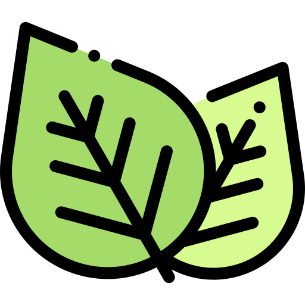

### Hello, It's me, Bastien  :bust_in_silhouette:

 

Former learner in specialized educator, I joined in 2020 the BeCode Training to become a web developer, especially in the
front-end.

Curious by nature and eager to learn more and more about web development, I will never stop to tend to a common purpose with the society who will trust me.

Passionnate about photography, personal growth and carring about the environment, my various hobbies could be a plus in a team (maybe yours).

## I'm a web dev student
- I recently worked on a Wordpress project. 
- I recently worked on a PHP project.
- I'm more interrested about the front-end.
- I currently learn React. 
- ...

 

### Languages and Tools

 

### Some of my projects
- [My CV](https://bastlaf.github.io/CV-new/)
- [Museum project](https://bastlaf.github.io/museum-project/)
- [Codepen stuff](https://codepen.io/bastlaf)
- [Forum built in PHP](https://github.com/bastlaf/Forum-bcbb-the-who)
- [WordPress Project](https://github.com/bastlaf/malabas)
- [React Pomodoro](https://github.com/bastlaf/pomodoro)

 
---

### Let's talk together
[][linkedin]

[linkedin]: https://www.linkedin.com/in/bastien-lafalize/
